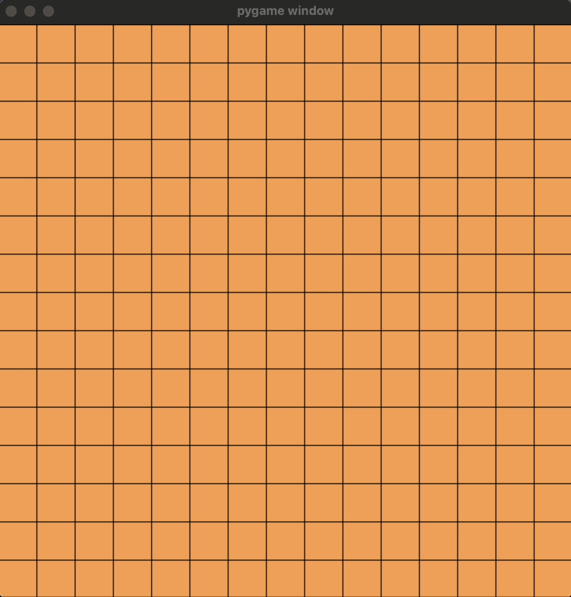

# Omok-Game (Gomoku) 🎲

## Description
This project implements the classic Omok (Gomoku) game using socket programming, designed for multi-agent reinforcement learning experiments.

Players compete to create an unbroken line of five stones horizontally, vertically, or diagonally, providing an ideal environment for AI agents to learn and strategize. 🖥️🔌

>[!WARNING]
> The game currently lacks implemented rules. Contributions to add rules are welcome through pull requests!

## Demo


## Installation
Get started with these simple steps:

1. **Clone the repository:**
   ```sh
   git clone https://github.com/hi-jin/Omok-Game.git
   cd Omok-Game
   ```

2. **Set up dependencies:**
   This project uses `Pipfile` for dependency management. Make sure you have `pipenv` installed, then run:
   ```sh
   pipenv install
   ```

## Usage
To get familiar with the project structure, take a look at the `test.py` file. Run it with:
```sh
pipenv run python test.py
```

## Contributing
Contributions are welcome! 🚀 Fork the repository, make your improvements, and submit a pull request. Whether it's adding game rules, enhancing features, or fixing bugs, your input is valuable.

## License
This project is released under the MIT License. For full details, refer to the `LICENSE` file. 📄

## Contact
Have questions or found an issue? Open an issue on the GitHub repository or reach out to the maintainer directly. I'm here to help! 💬
